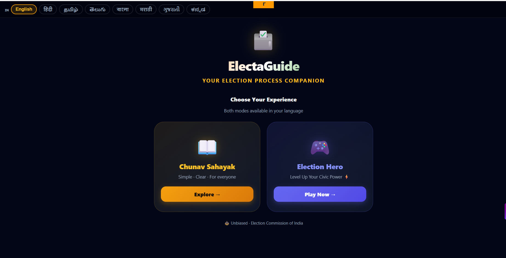

# ElectaGuide India

> **Hackathon Result: Ranked 360 / 19,552 participants — Top 1.8% globally**  
> Built for the Prompt Wars v2 international AI hackathon

An AI-powered voter assistance platform for India — available in **8 Indian languages**.  
Helps citizens navigate the voting process, find polling information, and engage with civic AI tools.

---

## Live App

**[electaguide-152578302488.us-central1.run.app](https://electaguide-152578302488.us-central1.run.app)**

---

## Screenshot



---

## What It Does

Two modes, one mission — making election information accessible to every Indian citizen:

| Mode | Description |
|------|-------------|
| **Chunav Sahayak** | AI assistant answering voter registration, polling, and ECI queries in plain language |
| **Election Hero** | Gamified civic education — learn your voting rights while earning points |

### Language Support
Available in 8 Indian languages:
`English` `हिंदी` `தமிழ்` `తెలుగు` `বাংলা` `मराठी` `ગુજરાતી` `ಕನ್ನಡ`

---

## Why This Matters

India has 968 million registered voters. The #1 barrier to participation is not motivation — it's **information access**. Most civic information exists only in English or dense government PDFs.

ElectaGuide makes election guidance conversational, multilingual, and instant.

---

## Tech Stack

| Layer | Technology |
|-------|------------|
| Frontend | React 18 + Vite |
| Backend | FastAPI (Python 3.11) |
| AI | Gemini 2.5 Flash via Google AI Studio |
| Languages | `google-genai` SDK with locale-aware prompting |
| Deploy | Google Cloud Run |
| Secrets | Google Secret Manager |

---

## Architecture

```
User (any of 8 languages)
        ↓
React SPA — language selector + chat UI
        ↓
FastAPI backend — /api/chat, /api/booth/{pincode}
        ↓
Gemini 2.5 Flash — locale-aware response generation
        ↓
ECI data + pincode → post office / polling area lookup
```

---

## Local Development

**Prerequisites:** Python 3.11+, Node.js 18+, [Gemini API key](https://aistudio.google.com/apikey)

```bash
# Backend
cd electaguide/backend
python -m venv .venv && source .venv/bin/activate
pip install -r requirements.txt
echo "GEMINI_API_KEY=your_key_here" > .env
python main.py        # http://localhost:8080

# Frontend
cd electaguide/frontend
npm install
npm run dev           # http://localhost:5173
```

---

## API

| Method | Path | Description |
|--------|------|-------------|
| GET | `/api/healthz` | Health check |
| POST | `/api/chat` | `{"query": "..."}` → AI response (locale-aware) |
| GET | `/api/booth/{pincode}` | Post offices for a 6-digit Indian pincode |

Rate limit: 10 req/min per IP on `/api/chat`

---

## Deploy to Cloud Run

```bash
gcloud services enable run.googleapis.com secretmanager.googleapis.com
echo "YOUR_GEMINI_KEY" | gcloud secrets create gemini-api-key --data-file=-

cd electaguide/backend
gcloud run deploy electaguide \
  --source . \
  --region us-central1 \
  --allow-unauthenticated \
  --update-secrets="GEMINI_API_KEY=gemini-api-key:latest"
```

---

## Hackathon Context

Built for **Prompt Wars v2** — an international AI competition with 19,552 participants across 177 countries.  
Final rank: **360 / 19,552 (Top 1.8% globally)**

The challenge: build an AI application that solves a real-world problem using LLM capabilities.  
ElectaGuide addressed civic information inequality at scale — a problem affecting nearly 1 billion voters.

---

## License

MIT
